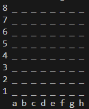

# Desenvolvimento de sistema de xadrez

Projeto desenvolvido dentro do curso de Java completo, do professor Nélio Alves, na plataforma Udemy

Foi usado no projeto todos os assuntos abordados até a chegada do modulo do projeto.

O objetivo é cada passo do desenvolvimento ser um commit no repositório do projeto

Projeto desenvolvido sem interface gráfica, sistema rodará em prompt de comando.!

[Projeto de tabuleiro de xadrez](chess-system-design.png)

## Primeiro passo: Posição
Checklist:
* Classe posição [public]
* **Tópicos de OOP**
  * Encapsulamento
  * Construtores
  * ToString

## Implementando Tabuleiro e Peça
Checklist:
* Classes Peça e Tabuleiro [public]
* **Tópicos de OOP**
  * Associação
  * Encapsulamento / Modificador de acesso
* **Estruturas de dados**
  * Matriz

## Camada Xadrez e impressão do tabuleiro

Formato do tabuleiro

Checklist:
* Métodos: Tabuleiro.Peça(linha, coluna) e Tabuleiro.Peca(Position)
* Enum Xadrez.cor
* Classe Xadrez.PecaXadrez [public]
* Classe Xadrez.PartidaXadrez [public]
* Classe XadrezConsole.UI
* **Tópicos OOP**
  * Enumeradores
  * Encapsulamento / Modificador de acesso
  * Herança
  * Downcasting
  * Membros estáticos
  * Padrão de camadas
* **Estrutura de dados**
  * Matriz

## Colocando as peças no tabuleiro
Checklist:
* Método: Tabuleiro.ColocarPeca(peça, posição)
* Classes: Torre, Rei [public]
* Método: PartidaXadrez.ConfigInicial
* **Tópicos OOP**
  * Herança
  * Sobrecarga
  * Polimorfismo (toString)